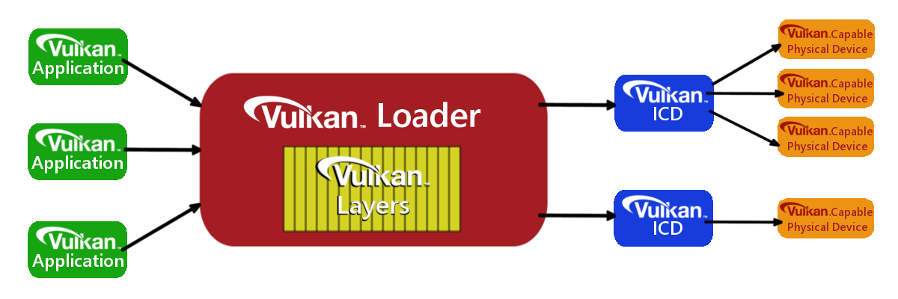
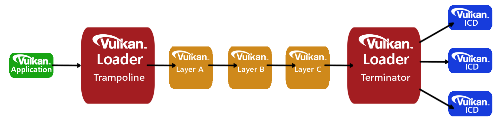
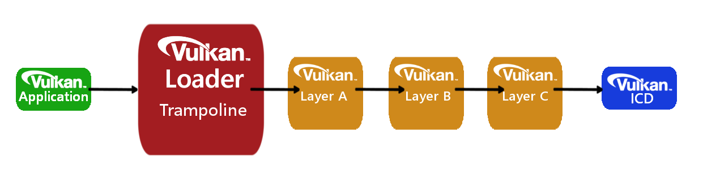
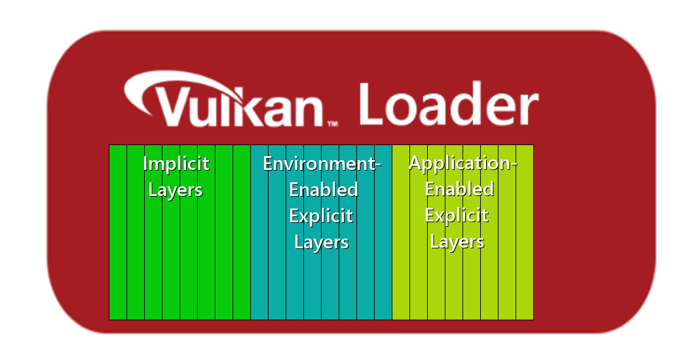

# Architecture of the Vulkan Loader Interfaces

## Table of Contents
 * [Overview](#overview)
  * [Goals of the Loader](#goals-of-the-loader)
  * [Who Should Read This Document](#who-should-read-this-document)
 * [Instance Versus Device](#instance-versus-device)
  * [Instance-related Items](#instance-related-items)
  * [Device-related Items](#device-related-items)
 * [Application Interface to the Loader](#application-interface-to-the-loader)
  * [Interfacing with Vulkan Commands](#interfacing-with-vulkan-commands)
    * [Vulkan Direct Exports](#vulkan-direct-exports)
    * [Indirectly Linking to the Loader](#indirectly-linking-to-the-loader)
    * [Best Application Performance Setup](#best-application-performance-setup)
    * [ABI Versioning](#abi-versioning)
  * [Application Layer Usage](#application-layer-usage)
    * [Forcing Layers to be Enabled](#forcing-layers-to-be-enabled)
    * [Implicit vs Explicit Layers](#implicit-vs-explicit-layers)
    * [Overall Layer Ordering](#overall-layer-ordering)
  * [Application Usage of Extensions](#application-usage-of-extensions)
    * [Instance and Device Extensions](#instance-and-device-extensions)
    * [WSI Extensions](#wsi-extensions)
    * [Unknown Extensions](#unknown-extensions)
 * [Loader and Layer Interface](#loader-and-layer-interface)
 * [Vulkan layer interface with the loader](#vulkan-layer-interface-with-the-loader)
 * [Layer interface requirements](#layer-interface-requirements)
 * [Vulkan Installable Client Driver interface with the loader](#vulkan-installable-client-driver-interface-with-the-loader)
 * [ICD interface requirements](#icd-interface-requirements)

## Overview

Vulkan is a layered architecture, made up of the following elements:
 * The Vulkan Application
 * The Vulkan Loader
 * Vulkan Layers
 * Vulkan-capable hardware controlled via Installable Client Drivers (ICDs)



As you can see, the application sits on one end, and interfaces directly to the loader.
The loader itself can contain some number of layers, which provide special
functionality an application may wish to take advantage of.  Finally, on the other
end of the loader from the application are the ICDs, which control the Vulkan-capable
hardware.  An important point to remember is that Vulkan-capable hardware can be
graphics-based, compute-based, or both.

Because of this, the Vulkan loader is a critical part of the Vulkan ecosystem,
acting as the mediator between these applications, layers, and ICDs.  This document
is intended to provide an overview of the necessary interfaces between each of these.

The general concepts in this document are applicable to the loaders available
for Windows, Linux and Android based systems.

#### Goals of the Loader

The loader was designed with the following goals in mind.
 1. Support one or more Vulkan-capable ICD on a user's computer system without them interfering with each other.
 2. Support Vulkan Layers which are optional modules that can be enabled by an application, developer, or standard system settings.
 3. Impact the overall performance of a Vulkan application in the lowest possible fashion.

#### Who Should Read This Document

While this document is primarily targeted at developers of Vulkan applications,
drivers and layers, the information contained in it could be useful to any
developer.

<br/>

## Instance Versus Device

There is an important concept which you will see brought up repeatedly throughout this
document.  Many commands, extensions, and other things in Vulkan are separated into
two main groups:
 * Instance-related Items
 * Device-related Items

#### Instance-related Items

A Vulkan Instance is a high-level construct used to provide Vulkan system-level
information, or functionality.  Vulkan items associated directly with an instance are:
 * VkInstance
 * VkPhysicalDevice

An Instance command is any Vulkan command which takes as its first parameter either an
item from the Instance list, or nothing at all.  Some Vulkan Instance commands are:
 * vkEnumerateInstanceExtensionProperties
 * vkCreateInstance
 * vkEnumeratePhysicalDevices

You query commands Vulkan Instance commands using the `vkGetInstanceProcAddr` command.
`vkGetInstanceProcAddr` can be used to query either device or instance entry points
in addition to all core entry points.  The returned function pointer is valid for
this Instance and any item created under this Instance (including all `VkDevice`s).  

Similarly, an Instance extension is a set of Vulkan Instance commands extending the Vulkan language.
These will be discussed in more detail later.


#### Device-related Items

A Vulkan Device, on the other-hand, is a logical identifier used to associate commands 
with a particular physical device on a user's system.  Vulkan constructs associated directly
with a device include:
 * VkDevice
 * VkQueue
 * VkCommandBuffer
 * Any dispatchable object that is a child of a one of the above.

A Device command is any Vulkan command which takes any Device item as its first
parameter.  Some Vulkan Device commands are:
 * vkQueueSubmit
 * vkBeginCommandBuffe
 * vkCreateEvent

You can query commands Vulkan Device commands using either the `vkGetInstanceProcAddr` or 
`vkGetDeviceProcAddr` commands.  If you choose to use `vkGetInstanceProcAddr`, it will have additional
level built into the call chain, which will reduce performance slightly.  However, the function pointer
returned can be used for any device created later, as long as it is associated with the same Vulkan Instance.
If, instead you use `vkGetDeviceProcAddr`, the call chain will be more optimized to the specific device,
but it will **only** work for the device used to query the command function pointer.  Also, unlike
`vkGetInstanceProcAddr`, `vkGetDeviceProcAddr` can only be used on core Vulkan Device commands, or
Device extension commands.

The best solution is to query Instance extension commands using `vkGetInstanceProcAddr`, and to
query Device extension commands using `vkGetDeviceProcAddr`.  See
[Best Application Performance Setup](#best-application-performance-setup) for more information on this.

As with Instance extensions, a Device extension is a set of Vulkan Device
commands extending the Vulkan language. You can read more about these later in the document.

You can query 

<br/>

## Application Interface to the Loader

In this section we'll discuss how an application interacts with the loader, including:
 * [Interfacing with Vulkan Commands](#interfacing-with-vulkan-commands)
  * [Vulkan Direct Exports](#vulkan-direct-exports)
  * [Indirectly Linking to the Loader](#indirectly-linking-to-the-loader)
  * [Best Application Performance Setup](#best-application-performance-setup)
  * [ABI Versioning](#abi-versioning)
 * [Application Layer Usage](#application-layer-usage)
  * [Forcing Layers to be Enabled](#forcing-layers-to-be-enabled)
  * [Implicit vs Explicit Layers](#implicit-vs-explicit-layers)
  * [Overall Layer Ordering](#overall-layer-ordering)
 * [Application Usage of Extensions](#application-usage-of-extensions)
  * [Instance and Device Extensions](#instance-and-device-extensions)
  * [WSI Extensions](#wsi-extensions)
  * [Unknown Extensions](#unknown-extensions)

#### Interfacing with Vulkan Commands
There are several ways you can interface with Vulkan commands through the loader.

##### Vulkan Direct Exports
The loader library on Windows, Linux and Android will export all core Vulkan
and all appropriate Window System Interface (WSI) extensions. This is done to
make it simpler to get started with Vulkan development. When an application
links directly to the loader library in this way, the Vulkan calls are simple
trampoline functions that jump to the appropriate dispatch table entry for the
object they are given.

##### Indirectly Linking to the Loader
Applications are not required to link directly to the loader library, instead
they can use the appropriate platform specific dynamic symbol lookup on the
loader library to initialize the application's own dispatch table. This allows
an application to fail gracefully if the loader cannot be found.  It also
provides the fastest mechanism for the application to call Vulkan functions. An
application will only need to query (via system calls such as dlsym()) the
address of `vkGetInstanceProcAddr` from the loader library. Using
`vkGetInstanceProcAddr` the application can then discover the address of all
functions and extensions available, such as `vkCreateInstance`,
`vkEnumerateInstanceExtensionProperties` and `vkEnumerateInstanceLayerProperties`
in a platform-independent way.

##### Best Application Performance Setup
If you desire the best performance possible, you should setup your own
dispatch table so that all your Instance commands are queried using `vkGetInstanceProcAddr`
and all your Device commands are queried using `vkGetDeviceProcAddr`.

*Why should you do this?*

The answer comes in how the call chain of Instance commands are implemented versus the
call chain of a Device commands.

A Vulkan Instance is a high-level construct used to provide Vulkan system-level
information, or functionality. Because of this, most Instance commands need to be
broadcasted to every available ICD on the system.  This is because, at any point
in the future, the application could create a `VkDevice` to any of the available
`VkPhysicalDevice`s on the system.  The following diagram shows an approximate view
of an Instance Chain with 3 enabled layers:



The above is also how any command chain looks if you query even a Vulkan Device
command (core or extension) using `vkGetInstanceProcAddr`.  However, a Device
command, on the other hand, doesn't need to worry about the broadcast
since it knows specifically which ICD and which Physical Device it is associated with.
Because of this, the loader doesn't need to get involved between any enabled
layers and the ICD.  Thus, if you used a loader-exported Vulkan command, the loader's
device chain in the same scenario as above would look like:



An even better solution would be for an application to perform a `vkGetDeviceProcAddr`
call on all Device functions.  This further optimizes the call chain by removing the
loader all-together under most scenarios:


Also, notice if no layers are enabled, your application function pointer would point
**directly to the ICD**.  If called enough, those fewer calls can add up to performance savings.

Remember:
 * `vkGetInstanceProcAddr` can be used to query
either device or instance entry points in addition to all core entry points.
 * `vkGetDeviceProcAddr` can only be used to query for device
extension or core device entry points.

##### ABI Versioning
The Vulkan loader library will be distributed in various ways including Vulkan
SDKs, OS package distributions and IHV driver packages. These details are
beyond the scope of this document. However, the name and versioning of the
Vulkan loader library is specified so an app can link to the correct Vulkan ABI
library version. Vulkan versioning is such that ABI backwards compatibility is
guaranteed for all versions with the same major number (e.g. 1.0 and 1.1). On
Windows, the loader library encodes the ABI version in its name such that
multiple ABI incompatible versions of the loader can peacefully coexist on a
given system. The Vulkan loader library file name is "vulkan-<ABI
version>.dll". For example, for Vulkan version 1.X on Windows the library
filename is vulkan-1.dll. And this library file can typically be found in the
windows/system32 directory (on 64-bit Windows installs, the 32-bit version of
the loader with the same name can be found in the windows/sysWOW64 directory).

For Linux, shared libraries are versioned based on a suffix. Thus, the ABI
number is not encoded in the base of the library filename as on Windows. On
Linux an application wanting to link to the latest Vulkan ABI version would
just link to the name vulkan (libvulkan.so).  A specific Vulkan ABI version can
also be linked to by applications (e.g. libvulkan.so.1).

#### Application Layer Usage

Applications desiring Vulkan functionality beyond what the core API offers may
use various layers or extensions. A layer cannot introduce new Vulkan API
entry-points to an application not exposed in Vulkan.h, but may offer extensions
that do. A common use of layers is for API validation which can be enabled by
loading the layer during application development, but not loading the layer
for application release. This eliminates the overhead of validating the
application's usage of the API, something that wasn't available on some previous
graphics APIs.

To find out what layers are available to your application, use the
`vkEnumerateInstanceLayerProperties` command.  This will report all layers
that have been discovered by the loader.  The loader looks in various locations
to find layers on the system.  For more information see the
[Layer discovery](#layer-discovery) section below.

To enable a layer, or layers, simply pass the name of the layers you wish to
enable in the `ppEnabledLayerNames` field of the `VkInstanceCreateInfo` during
a call to `vkCreateInstance`.  Once done, the layers you have enabled will be
active for all Vulkan commands using the created `VkInstance`, and any of
its child objects.

**NOTE:** Layer ordering is important in several cases since some layers
interact with each other.  Be careful when enabling layers as this may be
the case.

The following code section shows how you would go about enabling the
VK_LAYER_LUNARG_standard_validation layer.

```
   char *instance_validation_layers[] = {
        "VK_LAYER_LUNARG_standard_validation"
    };
    const VkApplicationInfo app = {
        .sType = VK_STRUCTURE_TYPE_APPLICATION_INFO,
        .pNext = NULL,
        .pApplicationName = "TEST_APP",
        .applicationVersion = 0,
        .pEngineName = "TEST_ENGINE",
        .engineVersion = 0,
        .apiVersion = VK_API_VERSION_1_0,
    };
    VkInstanceCreateInfo inst_info = {
        .sType = VK_STRUCTURE_TYPE_INSTANCE_CREATE_INFO,
        .pNext = NULL,
        .pApplicationInfo = &app,
        .enabledLayerCount = 1,
        .ppEnabledLayerNames = (const char *const *)instance_validation_layers,
        .enabledExtensionCount = 0,
        .ppEnabledExtensionNames = NULL,
    };
    err = vkCreateInstance(&inst_info, NULL, &demo->inst);
```

At `vkCreateInstance` and `vkCreateDevice`, the loader constructs call chains that
include the application specified (enabled) layers.  Order is important in the
`ppEnabledLayerNames` array; array element 0 is the topmost (closest to the
application) layer inserted in the chain and the last array element is closest
to the driver.

**NOTE:** *Device Layers Are Now Deprecated*
> `vkCreateDevice` originally was able to select layers in a similar manner to
> `vkCreateInstance`.  This lead to the concept of "instance
> layers" and "device layers".  It was decided by Khronos to deprecate the
> "device layer" functionality and only consider "instance layers".
> Therefore, `vkCreateDevice` will use the layers specified at `vkCreateInstance`.
> Because of this, the following items have been deprecated:
> * `VkDeviceCreateInfo` fields:
>  * `ppEnabledLayerNames`
>  * `enabledLayerCount`
> * `vkEnumerateDeviceLayerProperties`


##### Forcing Layers to be Enabled

Developers may want to enable layers that are not enabled by the given
application they are using. On Linux and Windows, the environment variable
"VK\_INSTANCE\_LAYERS" can be used to enable additional layers which are
not specified (enabled) by the application at `vkCreateInstance`.
VK\_INSTANCE\_LAYERS is a colon (Linux)/semi-colon (Windows) separated
list of layer names to enable. Order is relevant with the first layer in the
list being the top-most layer (closest to the application) and the last
layer in the list being the bottom-most layer (closest to the driver).

Application specified layers and user specified layers (via environment
variables) are aggregated and duplicates removed by the loader when enabling
layers. Layers specified via environment variable are top-most (closest to the
application) while layers specified by the application are bottommost.

An example of using these environment variables to activate the validation
layer VK\_LAYER\_LUNARG\_parameter\_validation on Windows or Linux is as follows:

```
> $ export VK_INSTANCE_LAYERS=VK_LAYER_LUNARG_parameter_validation
```

##### Implicit vs Explicit Layers

Some platforms, including Linux and Windows, support layers which are enabled
automatically by the loader rather than explicitly by the application (or via
environment variable). Explicit layers are those layers enabled by the
application (or environment variable) by providing the layer name. Implicit
layers are those layers enabled by the loader automatically. Any implicit
layers the loader discovers on the system in the appropriate location will be
enabled (subject to environment variable overrides described later).
Discovery of properly installed implicit and explicit layers is described later.
Explicitly enabling a layer that is implicitly enabled has no additional
effect: the layer will still be enabled implicitly by the loader.

Implicit layers have an additional requirement over explicit layers in that they
require being able to be disabled by an environmental variable.  This is due
to the fact that they are not visible to the application and could cause issues.
A good principle to keep in mind would be to define both an enable and disable
environment variable so the users can deterministicly enable the functionality.
On Desktop platforms (Windows and Linux), these enable/disable settings are
defined in the layer's JSON file.

##### Overall Layer Ordering

The overall ordering of all layers by the loader based on the above looks
as follows:



#### Application Usage of Extensions

Extensions are optional functionality provided by a layer, the loader or an
ICD. Extensions can modify the behavior of the Vulkan API and need to be
specified and registered with Khronos.  These extensions can be created
by an Independent Hardware Vendor (IHV) to expose new hardware functionality,
or by a layer writer to expose some internal feature, or by the loader to
improve functional behavior.  Information about various extensions can be
found in the Vulkan Spec, and vulkan.h header file.

##### Instance and Device Extensions

As hinted at in the [Instance Versus Device](#instance-versus-device) section,
there are really two types of extensions:
 * Instance Extensions
 * Device Extensions

An Instance extension is an extension which modifies existing behavior or
implements new behavior on Instance level objects, like a `VkInstance` or
a `VkPhysicalDevice`.  A Device extension is an extension which does the same,
but for any `VkDevice` object, or any dispatchable object that is a child of a
`VkDevice` (`VkQueue` and `VkCommandBuffer` are examples of these).

It is **very** important to know what type of extension you are desiring to
enable as you will enable Instance extensions during `vkCreateInstance` and
Device extensions during `vkCreateDevice`.

The loader discovers and aggregates all
extensions from layers (both explicit and implicit), ICDs and the loader before
reporting them to the application in vkEnumerate\*ExtensionProperties. 
 - Instance extensions are discovered via `vkEnumerateInstanceExtensionProperties`.
 - Device extensions are be discovered via `vkEnumerateDeviceExtensionProperties`.

Looking at vulkan.h, you'll notice that they are both similar.  For example,
`vkEnumerateInstanceExtensionProperties` prototype looks as follows:

```
   VkResult
   vkEnumerateInstanceExtensionProperties(const char *pLayerName,
                                          uint32_t *pPropertyCount,
                                          VkExtensionProperties *pProperties);
```

The pLayerName parameter in these functions is used to select either a single layer
or the Vulkan platform implementation. If pLayerName is NULL, extensions from
Vulkan implementation components (including loader, implicit layers, and ICDs)
are enumerated. If pLayerName is equal to a discovered layer module name then
only extensions from that layer (which may be implicit or explicit) are
enumerated. Duplicate extensions (e.g. an implicit layer and ICD might report
support for the same extension) are eliminated by the loader. For duplicates, the
ICD version is reported and the layer version is culled.

Also, Extensions *must be enabled* (in `vkCreateInstance` or
`vkCreateDevice`) before the commands associated with the extensions can be used.  If
you get an Extension command using either `vkGetInstanceProcAddr` or `vkGetDeviceProcAddr`,
but fail to enable it, you could experience undefined behavior.  This should actually
be flagged if you run with Validation layers enabled.


##### WSI Extensions

Khronos approved WSI extensions are available and provide Windows System Integration
support for various execution environments. It is important to understand that some WSI
extensions are valid for all targets, but others are particular to a given execution
environment (and loader). This desktop loader (currently targeting Windows and Linux)
only enables and directly exports those WSI extensions that are appropriate to the
current environment. For the most part, the selection is done in the loader using
compile-time preprocessor flags. All versions of the desktop loader currently expose
at least the following WSI extension support:
- VK_KHR_surface
- VK_KHR_swapchain
- VK_KHR_display

In addition, each of the following OS targets for the loader support target-specific extensions:

| Windowing System | Extensions available |
|----------------|--------------------|
| Windows  | VK_KHR_win32_surface |
| Linux (Default) |  VK_KHR_xcb_surface and VK_KHR_xlib_surface |
| Linux (Wayland) | VK_KHR_wayland_surface |
| Linux (Mir)  | VK_KHR_mir_surface |

**NOTE:** Wayland and Mir targets are not fully supported at this time and should be considered
alpha quality.

It is important to understand that while the loader may support the various entry-points
for these extensions, there is a hand-shake required to actually use them:
* At least one physical device must support the extension(s)
* The application must select such a physical device
* The application must request the extension(s) be enabled while creating the instance
or logical device (This depends on whether or not the given extension works with an instance or a device).
* The instance and/or logical device creation must succeed.

Only then can you expect to properly use a WSI extension in your Vulkan program.

##### Unknown Extensions

With the ability to expand Vulkan so easily, extensions will be created that the loader knows
nothing about.  If the extension is a device extension, the loader will pass the unknown
entry-point down the device call chain ending with the appropriate ICD entry-points.
However, if the extension is an instance extension, the loader will fail to load it.

*But why doesn't the loader support unknown instance extensions?*
<br/>
Let's look again at the Instance call chain:


Notice that for a normal instance function call, the loader has to handle passing along the
function call to the available ICDs.  If the loader has no idea of the parameters or return
value of the instance call, it can't properly pass information along to the ICDs.
There may be ways to do this, which will be explored in the future.  However, for now, this
loader does not support any unknown instance extensions.

Because the device call-chain does not pass through the loader terminator, this is not
a problem for device extensions.  Instead, device extensions terminate directly in the
ICD they are associated with.

*Is this a big problem?*
<br/>
No!  Most extension functionality only affects a device and not an instance or a physical
device.  Thus, the overwhelming majority of extensions will be device extensions rather than
instance extensions.

<br/>

## Loader and Layer Interface

Layers are implemented as libraries that can be enabled in different ways
(including by application request) and loaded during CreateInstance.  Each
layer can chooses to hook (intercept) any Vulkan commands which in turn
can be ignored, augmented, or simply passed along.  A layer may also
expose functionality not available in the loader or any ICD.  Some examples
of this include: the ability to perform Vulkan API tracing and debugging,
validate API usage, or overlay additional content on the applications surfaces.

The loader is responsible for working with the various layers as well as
supporting multiple GPUs and their drivers.  Any Vulkan command may
wind up calling into a diverse set of modules: loader, layers, and ICDs.
The loader is critical to managing the proper dispatching of Vulkan
commands to the appropriate set of layers and ICDs. The Vulkan object
model allows the loader to insert layers into a call chain so that the layers
can process Vulkan commands prior to the ICD being called.

Vulkan uses an object model to control the scope of a particular action /
operation.  The object to be acted on is always the first parameter of a Vulkan
call and is a dispatchable object (see Vulkan specification section 2.3 Object
Model).  Under the covers, the dispatchable object handle is a pointer to a
structure, which in turn, contains a pointer to a dispatch table maintained by
the loader.  This dispatch table contains pointers to the Vulkan functions appropriate to
that object.

There are two types of dispatch tables the loader maintains:
-  **Instance Dispatch Table**
  - Contains any function that takes a VkInstance or VkPhysicalDevice as their first parameter
    - vkEnumeratePhysicalDevices
    - vkDestroyInstance
    - vkCreateInstance
    - ...
-  **Device Dispatch Table**
  - Contains any function that takes a VkDevice, VkQueue or VkCommandBuffer as their first parameter

These instance and device dispatch tables are constructed when the application
calls vkCreateInstance and vkCreateDevice. At that time the application and/or
system can specify optional layers to be included. The loader will initialize
the specified layers to create a call chain for each Vulkan function and each
entry of the dispatch table will point to the first element of that chain.
Thus, the loader builds an instance call chain for each VkInstance that is
created and a device call chain for each VkDevice that is created.

For example, the diagram below represents what happens in the call chain for
vkCreateInstance. After initializing the chain, the loader will call into the
first layer's vkCreateInstance which will call the next finally terminating in
the loader again where this function calls every ICD's vkCreateInstance and
saves the results. This allows every enabled layer for this chain to set up
what it needs based on the VkInstanceCreateInfo structure from the application.


This also highlights some of the complexity the loader must manage when using
instance chains. As shown here, the loader must aggregate information from
multiple devices when they are present. This means that the loader has to know
about instance level extensions to aggregate them correctly.

Device chains are created at vkCreateDevice and are generally simpler because
they deal with only a single device and the ICD can always be the terminator of
the chain. The below diagram also illustrates how layers (either device or
instance) can skip intercepting any given Vulkan entry point.


<br/>

## Vulkan layer interface with the loader

### Layer discovery

#### Windows

<a name="ManifestFileExample"></a>
##### Properly-Installed Layers

In order to find properly-installed layers, the Vulkan loader will use a
similar mechanism as used for ICDs. Text information files (aka manifest
files), that use a JSON format, are read in order to identify the names and
attributes of layers and their extensions. The use of manifest files allows the
loader to avoid loading any shared library files when the application does not
query nor request any extensions. Layers and extensions have additional
complexity, and so their manifest files contain more information than ICD info
files. For example, a layer shared library file may contain multiple
layers/extensions (perhaps even an ICD).

In order to find properly-installed layers, the Vulkan loader will scan the
values in the following Windows registry keys:

HKEY\_LOCAL\_MACHINE\\SOFTWARE\\Khronos\\Vulkan\\ExplicitLayers

HKEY\_LOCAL\_MACHINE\\SOFTWARE\\Khronos\\Vulkan\\ImplicitLayers

Explicit layers are those which are enabled by an application (e.g. with the
vkCreateInstance function), or by an environment variable (as mentioned
previously).

Implicit layers are those which are enabled by their existence. For example,
certain application environments (e.g. Steam or an automotive infotainment
system) may have layers which they always want enabled for all applications
that they start. Other implicit layers may be for all applications started on a
given system (e.g. layers that overlay frames-per-second). Implicit layers are
enabled automatically, whereas explicit layers must be enabled explicitly. What
distinguishes a layer as implicit or explicit is by which registry key its
layer information file is referenced by.

For each value in these keys which has DWORD data set to 0, the loader opens
the JSON manifest file specified by the name of the value. Each name must be a
full pathname to the manifest file.

The Vulkan loader will open each info file to obtain information about the
layer, including the name or pathname of a shared library (".dll") file.

This manifest file is in the JSON format as shown in the following example.
See the section [Layer Library Manifest File](#LayerLibraryManifestFile) for more information about each of the nodes in the JSON file.

```
{
   "file_format_version" : "1.0.0",
   "layer": {
       "name": "VK_LAYER_LUNARG_overlay",
       "type": "INSTANCE",
       "library_path": "vkOverlayLayer.dll"
       "api_version" : "1.0.5",
       "implementation_version" : "2",
       "description" : "LunarG HUD layer",
       "functions": {
           "vkGetInstanceProcAddr": "OverlayLayer_GetInstanceProcAddr",
           "vkGetDeviceProcAddr": "OverlayLayer_GetDeviceProcAddr"
       },
       "instance_extensions": [
           {
               "name": "VK_EXT_debug_report",
               "spec_version": "1"
           },
           {
               "name": "VK_VENDOR_ext_x",
               "spec_version": "3"
            }
       ],
       "device_extensions": [
           {
               "name": "VK_EXT_debug_marker",
               "spec_version": "1",
               "entrypoints": ["vkCmdDbgMarkerBegin", "vkCmdDbgMarkerEnd"]
           }
       ],
       "enable_environment": {
           "ENABLE_LAYER_OVERLAY_1": "1"
       }
       "disable_environment": {
           "DISABLE_LAYER_OVERLAY_1": ""
       }
   }
}
```

The "library\_path" specifies either a filename, a relative pathname, or a full
pathname to a layer shared library (".dll") file, which the loader will attempt
to load using LoadLibrary(). If the layer is specified via a relative pathname,
it is relative to the path of the info file (e.g. for cases when an application
provides a layer that is in the same folder hierarchy as the rest of the
application files). If the layer is specified via a filename, the shared
library lives in the system's DLL search path (e.g. in the
"C:\\Windows\\System32" folder).

If defining multiple layers in a single JSON file prior to "file\_format\_version"
1.0.1, you would simply define multiple "layer" objects.  However, this is not
valid JSON syntax.  Instead, you should now define "file\_format\_version"
1.0.1 (or newer) and use the new "layers" array object as seen in the
following example:

```
{
   "file_format_version" : "1.0.1",
   "layers": [
      {
           "name": "VK_LAYER_layer_name1",
           "type": "INSTANCE",
           ...
      },
      {
           "name": "VK_LAYER_layer_name2",
           "type": "INSTANCE",
           ...
      }
   ]
}
```

You could use the "layers" array object to define a single layer, as long as
your "file\_format\_version" is defined to at least 1.0.1.  It is functionally the
same as using a single "layer" object.

There are no rules about the name of the text files (except the .json suffix).

There are no rules about the name of the layer shared library files.

##### Using Pre-Production Layers

As with ICDs, developers may need to use special, pre-production layers,
without modifying the properly-installed layers. This need is met with the use
of the "VK\_LAYER\_PATH" environment variable, which will override the
mechanism using for finding properly-installed layers. Because many layers may
exist on a system, this environment variable is a semi-colon-separated list of
folders that contain layer info files. Only the folder listed in
"VK\_LAYER\_PATH" will be scanned for info files. Each semi-colon-separated
entry is:

- The full pathname of a folder containing layer info files

#### Linux

##### Properly-Installed Layers

In order to find properly-installed layers, the Vulkan loader will use a
similar mechanism as used for ICDs. Text information files, that use a JSON
format, are read in order to identify the names and attributes of layers and
their extensions. The use of text info files allows the loader to avoid loading
any shared library files when the application does not query nor request any
extensions. Layers and extensions have additional complexity, and so their info
files contain more information than ICD info files. For example, a layer shared
library file may contain multiple layers/extensions (perhaps even an ICD).

The Vulkan loader will scan the files in the following Linux directories:

    /usr/local/etc/vulkan/explicit_layer.d
    /usr/local/etc/vulkan/implicit_layer.d
    /usr/local/share/vulkan/explicit_layer.d
    /usr/local/share/vulkan/implicit_layer.d
    /etc/vulkan/explicit_layer.d
    /etc/vulkan/implicit_layer.d
    /usr/share/vulkan/explicit_layer.d
    /usr/share/vulkan/implicit_layer.d
    $HOME/.local/share/vulkan/explicit_layer.d
    $HOME/.local/share/vulkan/implicit_layer.d

The "/usr/local/*" directories can be configured to be other directories at build time.

Where $HOME is the current home directory of the application's user id; this
path will be ignored for suid programs.

Explicit layers are those which are enabled by an application (e.g. with the
vkCreateInstance function), or by an environment variable (as mentioned
previously). Implicit layers are those which are enabled by their existence.
For example, certain application environments (e.g. Steam or an automotive
infotainment system) may have layers which they always want enabled for all
applications that they start. Other implicit layers may be for all applications
started on a given system (e.g. layers that overlay frames-per-second).
Implicit layers are enabled automatically, whereas explicit layers must be
enabled explicitly. What distinguishes a layer as implicit or explicit is by
which directory its layer information file exists in.

The "/usr/local/etc/vulkan/\*\_layer.d" and "/usr/local/share/vulkan/\*\_layer.d"
directories are for layers that are installed from locally-built sources.

The "/etc/vulkan/\*\_layer.d" directories are for layers that are installed from
non-Linux-distribution-provided packages.

The "/usr/share/vulkan/\*\_layer.d" directories are for layers that are
installed from Linux-distribution-provided packages.

This manifest file is in the JSON format as shown in the following example.
See the section [Layer Library Manifest File](#LayerLibraryManifestFile) for more information about each of the nodes in the JSON file.

```
{
   "file_format_version" : "1.0.0",
   "layer": {
       "name": "VK_LAYER_LUNARG_overlay",
       "type": "INSTANCE",
       "library_path": "libvkOverlayLayer.so"
       "api_version" : "1.0.5",
       "implementation_version" : "2",
       "description" : "LunarG HUD layer",
       "functions": {
           "vkGetInstanceProcAddr": "OverlayLayer_GetInstanceProcAddr",
           "vkGetDeviceProcAddr": "OverlayLayer_GetDeviceProcAddr"
       },
       "instance_extensions": [
           {
               "name": "VK_EXT_debug_report",
               "spec_version": "1"
           },
           {
               "name": "VK_VENDOR_ext_x",
               "spec_version": "3"
            }
       ],
       "device_extensions": [
           {
               "name": "VK_EXT_debug_marker",
               "spec_version": "1",
               "entrypoints": ["vkCmdDbgMarkerBegin", "vkCmdDbgMarkerEnd"]
           }
       ],
       "enable_environment": {
           "ENABLE_LAYER_OVERLAY_1": "1"
       },
       "disable_environment": {
           "DISABLE_LAYER_OVERLAY_1": ""
       }
   }
}
```
The "library\_path" specifies either a filename, a relative pathname, or a full
pathname to a layer shared library (".so") file, which the loader will attempt
to load using dlopen(). If the layer is specified via a filename, the loader
will attempt to open that file as a shared object using dlopen(), and the file
must be in a directory that dlopen is configured to look in (Note: various
distributions are configured differently). A distribution is free to create
Vulkan-specific system directories (e.g. ".../vulkan/layers"), but is not
required to do so. If the layer is specified via a relative pathname, it is
relative to the path of the info file (e.g. for cases when an application
provides a layer that is in the same directory hierarchy as the rest of the
application files).

There are no rules about the name of the text files (except the .json suffix).

There are no rules about the name of the layer shared library files.

##### Using Pre-Production Layers

As with ICDs, developers may need to use special, pre-production layers,
without modifying the properly-installed layers.  This need is met with the use
of the "VK\_LAYER\_PATH" environment variable, which will override the
mechanism using for finding properly-installed layers. Because many layers may
exist on a system, this environment variable is a colon-separated list of
directories that contain layer info files. Only the directories listed in
"VK\_LAYER\_PATH" will be scanned for info files. Each colon-separated entry
is:

- The full pathname of a directory containing layer info files

NOTE: these environment variables will be ignored for suid programs.

#### Android

The recommended way to enable layers is for applications
to programatically enable them. The layers are provided by the application
and must live in the application's library folder. The application
enables the layers at vkCreateInstance as any Vulkan
application would.
An application enabled for debug has more options. It can enumerate and enable
layers located in /data/local/debug/vulkan.

<br/>

## Layer interface requirements

#### Architectural interface overview

There are two key architectural features that drive the loader to layer library
interface: 1) separate and distinct instance and device call chains, and 2)
distributed dispatch. First these architectural features will be described and
then the detailed interface will be specified.

Call chains are the links of calls for a given Vulkan command from layer module
to layer module with the loader and or the ICD being the bottom most command.
Call chains are constructed at both the instance level and the device level by
the loader with cooperation from the layer libraries. Instance call chains are
constructed by the loader when layers are enabled at vkCreateInstance. Device
call chains are constructed by the loader when layers are enabled, by the loader, at
vkCreateDevice. A layer can intercept Vulkan instance commands, device commands
or both. For a layer to intercept instance commands, it must participate in the
instance call chain. For a layer to intercept device commands, it must
participate in the device chain.

Normally, when a layer intercepts a given Vulkan command, it will call down the
instance or device chain as needed. The loader and all layer libraries that
participate in a call chain cooperate to ensure the correct sequencing of calls
from one entity to the next. This group effort for call chain sequencing is
hereinafter referred to as distributed dispatch. In distributed dispatch, since
each layer is responsible for properly calling the next entity in the device or
instance chain, a dispatch mechanism is required for all Vulkan commands a
layer intercepts. For Vulkan commands that are not intercepted by a layer, or
if the layer chooses to terminate a given Vulkan command by not calling down
the chain, then no dispatch mechanism is needed for that particular Vulkan
command.  Only for those Vulkan commands, which may be a subset of all Vulkan
commands, that a layer intercepts is a dispatching mechanism by the layer
needed. The loader is responsible for dispatching all core and instance
extension Vulkan commands to the first entity in the chain.

Instance level Vulkan commands are those that have the dispatchable objects
VkInstance, or VkPhysicalDevice as the first parameter and also includes
vkCreateInstance.

Device level Vulkan commands are those that use VkDevice, VkQueue or
VkCommandBuffer as the first parameter and also include vkCreateDevice. Future
extensions may introduce new instance or device level dispatchable objects, so
the above lists may be extended in the future.

#### Layer Library Interface

A layer library is a container of layers.  This section defines an extensible
interface to discover layers contained in layer libraries.
The extensible programming interface is used on Android only. For Windows and Linux,
the layer manifest JSON files are used.

It also specifies the minimal conventions
and rules a layer must follow. Other sections might have other guidelines that layers should follow.

##### Layer Conventions and Rules

A layer, when inserted into an otherwise compliant Vulkan implementation, must
still result in a compliant Vulkan implementation[\*].  It must additionally
follow some conventions and rules.

A layer is always chained with other layers.  It must not make invalid calls
to or rely on undefined behaviors of its lower layers.  When it changes the
behavior of a command, it must make sure its upper layers do not make invalid
calls to or rely on undefined behaviors of its lower layers because of the
changed behavior.  For example, when a layer intercepts an object creation
command to wrap the objects created by its lower layers, it must make sure its
lower layers never see the wrapping objects, directly from itself or
indirectly from its upper layers.

When a layer requires host memory, it may ignore the provided allocators.  It
should use memory allocators if the layer is intended to run in a production
environment, such as an implicit layer that is always enabled.  That will
allow applications to include the layer's memory usage.

`vkEnumerateInstanceLayerProperties` must enumerate and only enumerate the
layer itself.

`vkEnumerateInstanceExtensionProperties` must handle the case where
`pLayerName` is itself.  It must return `VK_ERROR_LAYER_NOT_PRESENT`
otherwise, including when `pLayerName` is `NULL`.

`vkEnumerateDeviceLayerProperties` is deprecated and may be omitted.  The
behavior is undefined.

`vkEnumerateDeviceExtensionProperties` must handle the case where `pLayerName`
is itself.  In other cases, it should normally chain to other layers.

`vkCreateInstance` must not generate an error for unrecognized layer names and
extension names.  It may assume the layer names and extension names have been
validated.

`vkGetInstanceProcAddr` intercepts a Vulkan command by returning a local entry point,
otherwise it returns the value obtained by calling down the instance chain.
    These commands must be intercepted
   - vkGetInstanceProcAddr
   - vkCreateInstance
   - vkCreateDevice (only required for any device-level chaining)

   For compatibility with older layer libraries,
   - when `pName` is `vkCreateDevice`, it ignores `instance`.

`vkGetDeviceProcAddr` intercepts a Vulkan command by returning a local entry point,
otherwise it returns the value obtained by calling down the device chain.

The specification requires `NULL` to be returned from `vkGetInstanceProcAddr` and
`vkGetDeviceProcAddr` for disabled commands.  A layer may return `NULL` itself or
rely on the following layers to do so.

[\*]: The intention is for layers to have a well-defined baseline behavior.
Some of the conventions or rules, for example, may be considered abuses of the
specification.

##### Layer Library API Version 0

A layer library supporting interface version 0 must define and export these
introspection functions, unrelated to any Vulkan command despite the names,
signatures, and other similarities:

 - `vkEnumerateInstanceLayerProperties` enumerates all layers in a layer
   library.  This function never fails.

   When a layer library contains only one layer, this function may be an alias
   to the layer's `vkEnumerateInstanceLayerProperties`.

 - `vkEnumerateInstanceExtensionProperties` enumerates instance extensions of
   layers in a layer library.  `pLayerName` is always a valid layer name.
   This function never fails.

   When a layer library contains only one layer, this function may be an alias
   to the layer's `vkEnumerateInstanceExtensionProperties`.

 - `vkEnumerateDeviceLayerProperties` enumerates a subset (can be full,
   proper, or empty subset) of layers in a layer library.  `physicalDevice` is
   always `VK_NULL_HANDLE`.  This function never fails.

   If a layer is not enumerated by this function, it will not participate in
   device command interception.

 - `vkEnumerateDeviceExtensionProperties` enumerates device extensions of
   layers in a layer library.  `physicalDevice` is always `VK_NULL_HANDLE`.
   `pLayerName` is always a valid layer name.  This function never fails.

The introspection functions are not used by the desktop loader.

It must also define and export these functions one for each layer in the library:

 - `<layerName>GetInstanceProcAddr(instance, pName)` behaves identically to a layer's vkGetInstanceProcAddr except it is exported.

   When a layer library contains only one layer, this function may
   alternatively be named `vkGetInstanceProcAddr`.

 - `<layerName>GetDeviceProcAddr`  behaves identically to a layer's vkGetDeviceProcAddr except it is exported.

   When a layer library contains only one layer, this function may
   alternatively be named `vkGetDeviceProcAddr`.

All layers contained within a library must support [`vk_layer.h`][].  They do not need to
implement commands that they do not intercept.  They are recommended not to export
any commands.

<a name="LayerLibraryManifestFile"></a>
##### Layer Library Manifest File Version 0
On Windows and Linux (desktop), the loader uses manifest files to discover
layer libraries and layers.  The desktop loader doesn't directly query the
layer library except during chaining.
On Android, the loader queries the layer libraries via the introspection functions as outlined above.

The layer libraries and the manifest files must be kept in sync.

The following table associates the desktop JSON nodes with the layer library introspection queries. It also indicates requirements.

| Property | JSON node | Introspection query | Notes |
|----------|-----------|-----------------------|-------|
| file version | file_format_version | N/A | one node required per JSON file |
| layers in library | layer | vkEnumerateInstanceLayerProperties | one node required per layer |
| layer name | name | vkEnumerateInstanceLayerProperties | one node is required |
| layer type | type | vkEnumerate*LayerProperties | see Note 1 |
| library location | library_path | N/A | one node is required |
| vulkan spec version | api_version | vkEnumerateInstanceLayerProperties | one node is required |
| layer implementation version | api_version | vkEnumerateInstanceLayerProperties | see Note 2 |
| layer description | description | vkEnumerateInstanceLayerProperties | one node is required |
| chaining functions | functions | vkGet*ProcAddr | see Note 3 |
| instance extensions | instance_extensions | vkEnumerateInstanceExtensionProperties | see Note 4 |
| device extensions | device_extensions | vkEnumerateDeviceExtensionProperties | see Note 5 |
| enable implicit | enable_environment | N/A | See Note 6 |
| disable implicit | enable_environment | N/A | See Note 7 |

"file\_format\_version" is used to indicate the valid JSON syntax of the file.
As nodes are added or deleted which would change the parsing of this file,
the file_format_version should change. This version
is NOT the same as the layer library interface version. The interface version is a superset
of the "file_format_version" and includes the semantics of the nodes in the JSON file.
For interface version 0 the file format version must be "1.0.0"

Note 1: Prior to deprecation, the "type" node was used to indicate which layer chain(s)
to activate the layer upon: instance, device, or both.
Distinct instance and device layers are deprecated; there are now just layers.
Allowable values for type (both before and after deprecation) are "INSTANCE", "GLOBAL" and, "DEVICE."
"DEVICE" layers are skipped over by the loader as if they were not found.
Thus, layers must have a type of "GLOBAL" or "INSTANCE" for the loader to include the layer in the enumerated instance layer list.

"library\_path" is the filename, full path, or relative path to the library file.
See [Manifest File Example](#ManifestFileExample) section for more details.

Note 2: One "implementation\_version" node is required per layer. This node gives the layer version, a single number
increasing with backward uncompatible changes.

Note 3: The "functions" node is required if the layer is using alternative
names for vkGetInstanceProcAddr or vkGetDeviceProcAddr. vkGetInstanceProcAddr and vkGetDeviceProcAddr
are required for all layers. See further requirements in the Layer Library API section above.

Note 4: One "instance_extensions" node with an array of one or more elements
required if any instance
extensions are supported by a layer, otherwise the node is optional.  Each
element of the array must have the nodes "name" and "spec_version" which
correspond to  VkExtensionProperties "extensionName" and "specVersion"
respectively.

Note 5: One "device_extensions" node with an array of one or more elements
required if any device
extensions are supported by a layer, otherwise the node is optional.  Each
element of the array must have the nodes "name" and "spec_version" which
correspond to  VkExtensionProperties "extensionName" and "specVersion"
respectively. Additionally, each element of the array of device extensions
must have the node "entrypoints" if the device extension adds Vulkan API commands,
otherwise this node is not required.
The "entrypoint" node is an array of the names of all entrypoints added by the
supported extension.
```
    "device_extensions": [
        {
            "name": "VK_EXT_debug_marker",
            "spec_version": "1",
            "entrypoints": ["vkCmdDbgMarkerBegin", "vkCmdDbgMarkerEnd"]
        }
 ```

Note 6: The "enable\_environment" node is only for implicit layers only. It is optional for implicit layers.
This node gives an environment variable and value required to enable an implicit layer. This
environment variable (which should vary with each "version" of the layer) must be set to the
given value or else the implicit layer is not loaded. This is for application environments (e.g. Steam) which
want to enable a layer(s) only for applications that they launch, and allows
for applications run outside of an application environment to not get that
implicit layer(s).

Note 7: The "disable\_environment" node is only for implicit layers only. It is required for implicit layers.
This node gives an environment variable and value required to disable an implicit layer. In
rare cases of an application not working with an implicit layer, the
application can set this environment variable (before calling Vulkan commands)
in order to "blacklist" the layer. This environment variable (which should vary
with each "version" of the layer) must be set (not particularly to any value).
If both the "enable\_environment" and
"disable\_environment" variables are set, the implicit layer is disabled.

#### Layer Dispatch Interface Version 0
##### Layer intercept requirements

- Layers intercept a Vulkan command by defining a C/C++ function with signature
identical to the Vulkan API for that command.
- A layer must intercept at least vkGetInstanceProcAddr and
vkCreateInstance.  Additionally, a layer would also intercept vkGetDeviceProcAddr and vkCreateDevice to participate in the device chain.
- For any Vulkan command a layer intercepts which has a non-void return value,
an appropriate value must be returned by the layer intercept function.
- The layer intercept function must call down the chain to the corresponding
Vulkan command in the next entity. Undefined results will occur if a layer
doesn't propagate calls down the chain. The two exceptions to this requirement
are vkGetInstanceProcAddr and vkGetDeviceProcAddr which only call down the
chain for Vulkan commands that they do not intercept.
- Layer intercept functions may insert extra calls to Vulkan commands in
addition to the intercept. For example, a layer intercepting vkQueueSubmit may
want to add a call to vkQueueWaitIdle after calling down the chain for
vkQueueSubmit.  Any additional calls inserted by a layer must be on the same
chain. They should call down the chain.

##### Distributed dispatching requirements

- For each entry point a layer intercepts, it must keep track of the entry
point residing in the next entity in the chain it will call down into. In other
words, the layer must have a list of pointers to functions of the appropriate
type to call into the next entity. This can be implemented in various ways but
for clarity will be referred to as a dispatch table.
- A layer can use the VkLayerDispatchTable structure as a device dispatch table
(see include/vulkan/vk_layer.h).
- A layer can use the VkLayerInstanceDispatchTable structure as a instance
dispatch table (see include/vulkan/vk_layer.h).
- Layers vkGetInstanceProcAddr function uses the next entity's
vkGetInstanceProcAddr to call down the chain for unknown (i.e. non-intercepted)
functions.
- Layers vkGetDeviceProcAddr function uses the next entity's
vkGetDeviceProcAddr to call down the chain for unknown (i.e. non-intercepted)
functions.

##### Layer dispatch initialization

- A layer initializes its instance dispatch table within its vkCreateInstance
function.
- A layer initializes its device dispatch table within its vkCreateDevice
function.
- The loader passes a linked list of initialization structures to layers via
the "pNext" field in the VkInstanceCreateInfo and VkDeviceCreateInfo structures
for vkCreateInstance  and VkCreateDevice respectively.
- The head node in this linked list is of type VkLayerInstanceCreateInfo for
instance and VkLayerDeviceCreateInfo for device. See file
include/vulkan/vk_layer.h for details.
- A VK_STRUCTURE_TYPE_LOADER_INSTANCE_CREATE_INFO is used by the loader for the
"sType" field in VkLayerInstanceCreateInfo.
- A VK_STRUCTURE_TYPE_LOADER_DEVICE_CREATE_INFO is used by the loader for the
"sType" field in VkLayerDeviceCreateInfo.
- The "function" field indicates how the union field "u" should be interpreted
within VkLayer*CreateInfo. The loader will set the "function" field to
VK_LAYER_LINK_INFO. This indicates "u" field should be VkLayerInstanceLink or
VkLayerDeviceLink.
- The VkLayerInstanceLink and VkLayerDeviceLink structures are the list nodes.
- The VkLayerInstanceLink contains the next entity's vkGetInstanceProcAddr used
by a layer.
- The VkLayerDeviceLink contains the next entity's vkGetInstanceProcAddr and
vkGetDeviceProcAddr used by a layer.
- Given the above structures set up by the loader, layer must initialize their
dispatch table as follows:
  - Find the  VkLayerInstanceCreateInfo/VkLayerDeviceCreateInfo structure in
the VkInstanceCreateInfo/VkDeviceCreateInfo structure.
  - Get the next entity's vkGet*ProcAddr from the "pLayerInfo" field.
  - For CreateInstance get the next entity's vkCreateInstance by calling the
"pfnNextGetInstanceProcAddr":
     pfnNextGetInstanceProcAddr(NULL, "vkCreateInstance").
  - For CreateDevice get the next entity's vkCreateDevice by calling the
"pfnNextGetInstanceProcAddr":
     pfnNextGetInstanceProcAddr(NULL, "vkCreateDevice").
  - Advanced the linked list to the next node: pLayerInfo = pLayerInfo->pNext.
  - Call down the chain either CreateDevice or CreateInstance
  - Initialize your layer dispatch table by calling the next entity's
Get*ProcAddr function once for each Vulkan command needed in your dispatch
table

##### Example code for CreateInstance

```cpp
VkResult vkCreateInstance(
        const VkInstanceCreateInfo *pCreateInfo,
        const VkAllocationCallbacks *pAllocator,
        VkInstance *pInstance)
{
   VkLayerInstanceCreateInfo *chain_info =
        get_chain_info(pCreateInfo, VK_LAYER_LINK_INFO);

    assert(chain_info->u.pLayerInfo);
    PFN_vkGetInstanceProcAddr fpGetInstanceProcAddr =
        chain_info->u.pLayerInfo->pfnNextGetInstanceProcAddr;
    PFN_vkCreateInstance fpCreateInstance =
        (PFN_vkCreateInstance)fpGetInstanceProcAddr(NULL, "vkCreateInstance");
    if (fpCreateInstance == NULL) {
        return VK_ERROR_INITIALIZATION_FAILED;
    }

    // Advance the link info for the next element of the chain
    chain_info->u.pLayerInfo = chain_info->u.pLayerInfo->pNext;

    // Continue call down the chain
    VkResult result = fpCreateInstance(pCreateInfo, pAllocator, pInstance);
    if (result != VK_SUCCESS)
        return result;

    // Init layer's dispatch table using GetInstanceProcAddr of
    // next layer in the chain.
    instance_dispatch_table = new VkLayerInstanceDispatchTable;
    layer_init_instance_dispatch_table(
        *pInstance, my_data->instance_dispatch_table, fpGetInstanceProcAddr);

    // Other layer initialization
    ...

    return VK_SUCCESS;
}
```

##### Example code for CreateDevice

```cpp
VkResult 
vkCreateDevice(
        VkPhysicalDevice gpu,
        const VkDeviceCreateInfo *pCreateInfo,
        const VkAllocationCallbacks *pAllocator,
        VkDevice *pDevice)
{
    VkLayerDeviceCreateInfo *chain_info =
        get_chain_info(pCreateInfo, VK_LAYER_LINK_INFO);

    PFN_vkGetInstanceProcAddr fpGetInstanceProcAddr =
        chain_info->u.pLayerInfo->pfnNextGetInstanceProcAddr;
    PFN_vkGetDeviceProcAddr fpGetDeviceProcAddr =
        chain_info->u.pLayerInfo->pfnNextGetDeviceProcAddr;
    PFN_vkCreateDevice fpCreateDevice =
        (PFN_vkCreateDevice)fpGetInstanceProcAddr(NULL, "vkCreateDevice");
    if (fpCreateDevice == NULL) {
        return VK_ERROR_INITIALIZATION_FAILED;
    }

    // Advance the link info for the next element on the chain
    chain_info->u.pLayerInfo = chain_info->u.pLayerInfo->pNext;

    VkResult result = fpCreateDevice(gpu, pCreateInfo, pAllocator, pDevice);
    if (result != VK_SUCCESS) {
        return result;
    }

    // initialize layer's dispatch table
    device_dispatch_table = new VkLayerDispatchTable;
    layer_init_device_dispatch_table(
        *pDevice, device_dispatch_table, fpGetDeviceProcAddr);

    // Other layer initialization
    ...

    return VK_SUCCESS;
}
```

#### Special Considerations
##### Associating private data with Vulkan objects within a layer
A layer may want to associate it's own private data with one or more Vulkan
objects.  Two common methods to do this are hash maps and object wrapping. 

###### Wrapping:

The loader supports layers wrapping any Vulkan object including dispatchable
objects.
For commands that return object handles, the layer saves the handle that is
returned from a lower-level layer (possibly the ICD), and returns its own
handle to the layer above it (possibly the application).  For commands that are
given previously-returned handles, the layer unwraps the handle; that is it
looks up the saved handle and gives that to the layer below it.

Layers which wrap objects must ensure they always unwrap objects before passing
them down the chain.  This means that the layer must intercept every Vulkan
command which uses the object in question, and wrap or unwrap the object, as
appropriate.  This includes adding support for all extensions with commands
using any object the layer wraps.

Layers above the object wrapping layer will see the wrapped object. Layers
which wrap dispatchable objects must ensure that the first field in the wrapping
structure is a pointer to a dispatch table as defined in vk_layer.h. Specifically, an
instance wrapped dispatchable object could be as follows:
```
struct my_wrapped_instance_obj_ {
    VkLayerInstanceDispatchTable *disp;
    // whatever data layer wants to add to this object
};
```
A device wrapped dispatchable object could be as follows:
```
struct my_wrapped_instance_obj_ {
    VkLayerDispatchTable *disp;
    // whatever data layer wants to add to this object
};
```

Layers that wrap dispatchable objects must follow the guidelines for creating
new dispatchable objects (below).

<u><b>Cautions</b></u>

Layers are generally discouraged from wrapping objects, because of the
potential for incompatibilities with new extensions.  For example, let's say
that a layer wraps VkImage objects, and properly wraps and unwraps VkImage
object handles for all core commands.  If a new extension is created which has
commands that take VkImage objects as parameters, and if the layer does not
support those new commands, an application that uses both the layer and the new
extension will have undefined behavior when those new commands are called (e.g.
the application may crash).  This is becaues the lower-level layers and ICD
won't receive the handle that they generated.  Instead, they will receive a
handle that is only known by the layer that is wrapping the object.

Because of the potential for incompatibilities with unsupported extensions,
layers that wrap objects must check which extensions are being used by the
application, and take appropriate action if the layer is used with unsupported
extensions (e.g. disable layer functionality, stop wrapping objects, issue a
message to the user).

The reason that the validation layers wrap objects, is to track the proper use
and destruction of each object.  They issue a validation error if used with
unsupported extensions, alerting the user to the potential for undefined
behavior.

###### Hash Maps:
Alternatively, a layer may want to use a hash map to associate data with a
given object. The key to the map could be the object. Alternatively, for
dispatchable objects at a given level (eg device or instance) the layer may
want data associated with the VkDevice or VkInstance objects. Since
there are multiple dispatchable objects for a given VkInstance or VkDevice, the
VkDevice or VkInstance object is not a great map key. Instead the layer should
use the dispatch table pointer within the VkDevice or VkInstance since that
will be unique for a given VkInstance or VkDevice.

##### Creating new dispatchable objects
Layers which create dispatchable objects take special care. Remember that loader
trampoline code normally fills in the dispatch table pointer in the newly
created object. Thus, the layer must fill in the dispatch table pointer if the
loader trampoline will not do so.  Common cases where a layer (or ICD) may create a
dispatchable object without loader trampoline code is as follows:
- object wrapping layers that wrap dispatchable objects
- layers which add extensions that create dispatchable objects
- layers which insert extra Vulkan commands in the stream of commands they
intercept from the application
- ICDs which add extensions that create dispatchable objects

The Windows/Linux loader provides a callback that can be used for initializing
a dispatchable object.  The callback is passed as an extension structure via the
pNext field in VkInstanceCreateInfo and VkDeviceCreateInfo.  The callback prototype
is defined as follows for instance and device callbacks respectively (see vk_layer.h):
```
VKAPI_ATTR VkResult VKAPI_CALL vkSetInstanceLoaderData(VkInstance instance, void *object);
VKAPI_ATTR VkResult VKAPI_CALL vkSetDeviceLoaderData)(VkDevice device, void *object);
```
To obtain these callbacks the layer must search through the list of structures
pointed to by the "pNext" field in the VkInstanceCreateInfo  and VkDeviceCreateInfo parameters to find any callback structures inserted by the loader. The salient details are as follows:
- For CreateInstance the callback structure pointed to by "pNext" is VkLayerInstanceCreateInfo as defined in vk_layer.h.
- A "sType" field in of VK_STRUCTURE_TYPE_LOADER_INSTANCE_CREATE_INFO within VkInstanceCreateInfo parameter indicates a loader structure.
- Within VkLayerInstanceCreateInfo, the "function" field indicates how the union field "u" should be interpreted.
- A "function" equal to VK_LOADER_DATA_CALLBACK indicates the "u" field will contain the callback in "pfnSetInstanceLoaderData".
- For CreateDevice the callback structure pointed to by "pNext" is VkLayerDeviceCreateInfo as defined in include/vulkan/vk_layer.h.
- A "sType" field in of VK_STRUCTURE_TYPE_LOADER_DEVICE_CREATE_INFO within VkDeviceCreateInfo parameter indicates a loader structure.
- Within VkLayerDeviceCreateInfo, the "function" field indicates how the union field "u" should be interpreted.
- A "function" equal to VK_LOADER_DATA_CALLBACK indicates the "u" field will contain the callback in "pfnSetDeviceLoaderData".

Alternatively, if an older loader is being used that doesn't provide these callbacks, the layer may manually initialize the newly created dispatchable object.
To fill in the dispatch table pointer in newly created dispatchable object,
the layer should copy the dispatch pointer, which is always the first entry in the structure, from an existing parent object of the same level (instance versus
device). For example, if there is a newly created VkCommandBuffer object, then the dispatch pointer from the VkDevice object, which is the parent of the VkCommandBuffer object, should be copied into the newly created object.

<br/>

## Vulkan Installable Client Driver interface with the loader

### ICD discovery

Vulkan allows multiple drivers each with one or more devices (represented by a
Vulkan VkPhysicalDevice object) to be used collectively. The loader is
responsible for discovering available Vulkan ICDs on the system. Given a list
of available ICDs, the loader can enumerate all the physical devices available
for an application and return this information to the application. The process
in which the loader discovers the available Installable Client Drivers (ICDs)
on a system is platform dependent. Windows, Linux and Android ICD discovery
details are listed below.

#### Windows

##### Properly-Installed ICDs

In order to find properly-installed ICDs, the Vulkan loader will scan the
values in the following Windows registry key:

HKEY\_LOCAL\_MACHINE\\SOFTWARE\\Khronos\\Vulkan\\Drivers

On 64-bit Windows, when a 32-bit application is triggered, the loader
will scan for 32-bit drivers in a separate area of the registry:

HKEY\_LOCAL\_MACHINE\\SOFTWARE\\WOW6432Node\\Khronos\\Vulkan\\Drivers

For each value in this key which has DWORD data set to 0, the loader opens the
JSON format text information file (a.k.a. "manifest file") specified by the
name of the value. Each name must be a full pathname to the text manifest file.
The Vulkan loader will open each manifest file to obtain the name or pathname
of an ICD shared library (".dll") file. For example:

 ```
 {
    "file_format_version": "1.0.0",
    "ICD": {
        "library_path": "path to ICD library",
        "api_version": "1.0.5"
    }
  }
  ```


The "library\_path" specifies either a filename, a relative pathname, or a full
pathname to an ICD shared library file, which the loader will attempt to load
using LoadLibrary(). If the ICD is specified via a filename, the shared library
lives in the system's DLL search path (e.g. in the "C:\Windows\System32"
folder). If the ICD is specified via a relative pathname, it is relative to the
path of the manifest file. Relative pathnames are those that do not start with
a drive specifier (e.g. "C:"), nor with a directory separator (i.e. the '\\'
character), but do contain at least one directory separator.

The "file\_format\_version" specifies a major.minor.patch version number in
case the format of the text information file changes in the future. If the same
ICD shared library supports multiple, incompatible versions of text manifest
file format versions, it must have separate JSON files for each (all of which may
point to the same shared library).

The "api\_version" specifies the major.minor.patch version number of the Vulkan
API that the shared library (referenced by "library\_path") was built with.

There are no rules about the name of the text information files (except the
.json suffix).

There are no rules about the name of the ICD shared library files. For example,
if the registry contains the following values,

```
[HKEY_LOCAL_MACHINE\SOFTWARE\Khronos\Vulkan\Drivers\]

"C:\vendor a\vk_vendora.json"=dword:00000000

"C:\windows\system32\vendorb_vk.json"=dword:00000000

"C:\windows\system32\vendorc_icd.json"=dword:00000000
```
then the loader will open the following text information files, with the
specified contents:

| Text File Name | Text File Contents |
|----------------|--------------------|
|vk\_vendora.json  | "ICD": { "library\_path": "C:\VENDOR A\vk_vendora.dll", "api_version": "1.0.5" } |
| vendorb\_vk.json |  "ICD": { "library\_path": "vendorb\_vk.dll", "api_version": "1.0.5" } |
|vendorc\_icd.json  | "ICD": { "library\_path": "vedorc\_icd.dll", "api_version": "1.0.5" }|

Then the loader will open the three files mentioned in the "Text File Contents"
column, and then try to load and use the three shared libraries indicated by
the ICD.library\_path value.

##### Using Pre-Production ICDs

IHV developers (and sometimes other developers) need to use special,
pre-production ICDs. In some cases, a pre-production ICD may be in an
installable package. In other cases, a pre-production ICD may simply be a
shared library in the developer's build tree. In this latter case, we want to
allow developers to point to such an ICD without modifying the
properly-installed ICD(s) on their system.

This need is met with the use of the "VK\_ICD\_FILENAMES" environment variable,
which will override the mechanism used for finding properly-installed ICDs. In
other words, only the ICDs listed in "VK\_ICD\_FILENAMES" will be used. The
"VK\_ICD\_FILENAMES" environment variable is a semi-colon-separated list of ICD
text information files (aka manifest files), containing the following:

- A full pathname (e.g. "C:\\my\_build\\my\_icd.json")

Typically, "VK\_ICD\_FILENAMES" will only contain a full pathname to one info
file for a developer-built ICD. A semi-colon is only used if more than one ICD
is listed.

For example, if a developer wants to refer to one ICD that they built, they
could set the "VK\_ICD\_FILENAMES" environment variable to:

C:\\my\_build\\my\_icd.json

If a developer wants to refer to two ICDs, one of which is a properly-installed
ICD, they can use the full pathname of the text file:

C:\\Windows\\System32\\vendorc\_icd.json;C:\\my\_build\\my\_icd.json

Notice the semi-colon between "C:\\Windows\\System32\\vendorc\_icd.json" and
"C:\\my\_build\\my\_icd.json".

#### Linux

##### Properly-Installed ICDs

In order to find properly-installed ICDs, the Vulkan loader will scan the files
in the following Linux directories:

```
    /usr/local/etc/vulkan/icd.d
    /usr/local/share/vulkan/icd.d
    /etc/vulkan/icd.d
    /usr/share/vulkan/icd.d
    $HOME/.local/share/vulkan/icd.d
```

The "/usr/local/*" directories can be configured to be other directories at build time.

Where $HOME is the current home directory of the application's user id; this
path will be ignored for suid programs.

These directories will contain text information files (a.k.a. "manifest
files"), that use a JSON format.

The Vulkan loader will open each manifest file found to obtain the name or
pathname of an ICD shared library (".so") file. For example:

```
{
    "file_format_version": "1.0.0",
    "ICD": {
        "library_path": "path to ICD library",
        "api_version": "1.0.5"
    }
}
```
The "library\_path" specifies either a filename, a relative pathname, or a full
pathname to an ICD shared library file. If the ICD is specified via a filename,
the loader will attempt to open that file as a shared object using dlopen(),
and the file must be in a directory that dlopen is configured to look in (Note:
various distributions are configured differently). A distribution is free to
create Vulkan-specific system directories (e.g. ".../vulkan/icd"), but is not
required to do so. If the ICD is specified via a relative pathname, it is
relative to the path of the info file. Relative pathnames are those that do not
start with, but do contain at least one directory separator (i.e. the '/'
character). For example, "lib/vendora.so" and "./vendora.so" are examples of
relative pathnames.

The "file\_format\_version" provides a major.minor.patch version number in case
the format of the manifest file changes in the future. If the same ICD shared
library supports multiple, incompatible versions of manifest file format
versions, it must have multiple manifest files (all of which may point to the
same shared library).

The "api\_version" specifies the major.minor.patch version number of the Vulkan
API that the shared library (referenced by "library\_path") was built with.

The "/usr/local/etc/vulkan/icd.d" and "/usr/local/share/vulkan/icd.d"
directories are for locally-built ICDs.

The "/etc/vulkan/icd.d" directory is for
ICDs that are installed from non-Linux-distribution-provided packages.

The "/usr/share/vulkan/icd.d" directory is for ICDs that are installed from
Linux-distribution-provided packages. 

There are no rules about the name of the text files (except the .json suffix).

There are no rules about the name of the ICD shared library files. For example,
if the "/usr/share/vulkan/icd.d" directory contain the following files, with
the specified contents:

| Text File Name    | Text File Contents     |
|-------------------|------------------------|
| vk\_vendora.json | "ICD": { "library\_path": "vendora.so", "api_version": "1.0.5" } |
| vendorb\_vk.json | "ICD": { "library\_path": "vendorb\_vulkan\_icd.so", "api_version": "1.0.5" } |
| vendorc\_icd.json | "ICD": { "library\_path": "/usr/lib/VENDORC/icd.so", "api_version": "1.0.5" } |

then the loader will open the three files mentioned in the "Text File Contents"
column, and then try to load and use the three shared libraries indicated by
the ICD.library\_path value.

##### Using Pre-Production ICDs

IHV developers (and sometimes other developers) need to use special,
pre-production ICDs. In some cases, a pre-production ICD may be in an
installable package. In other cases, a pre-production ICD may simply be a
shared library in the developer's build tree. In this latter case, we want to
allow developers to point to such an ICD without modifying the
properly-installed ICD(s) on their system.

This need is met with the use of the "VK\_ICD\_FILENAMES" environment variable,
which will override the mechanism used for finding properly-installed ICDs. In
other words, only the ICDs listed in "VK\_ICD\_FILENAMES" will be used.

The "VK\_ICD\_FILENAMES" environment variable is a colon-separated list of ICD
manifest files, containing the following:

- A filename (e.g. "libvkicd.json") in the
"/usr/local/etc/vulkan/icd.d",
"/usr/local/share/vulkan/icd.d",
"/etc/vulkan/icd.d",
"/usr/share/vulkan/icd.d",
"$HOME/.local/share/vulkan/icd.d"
directories

- A full pathname (e.g. "/my\_build/my\_icd.json")

Typically, "VK\_ICD\_FILENAMES" will only contain a full pathname to one info
file for a developer-built ICD. A colon is only used if more than one ICD is
listed.

For example, if a developer wants to refer to one ICD that they built, they
could set the "VK\_ICD\_FILENAMES" environment variable to:

/my\_build/my\_icd.json

If a developer wants to refer to two ICDs, one of which is a properly-installed
ICD, they can use the name of the text file in the system directory:

vendorc\_vulkan.json:/my\_build/my\_icd.json

Notice the colon between "vendorc\_vulkan.json" and "/my\_build/my\_icd.json".

NOTE: this environment variable will be ignored for suid programs.

#### Android

The Android loader lives in the system library folder. The location cannot be
changed. The loader will load the driver/ICD via hw_get_module with the ID
of "vulkan". Due to security policies in Android none of this can be modified
under normal use.

<br/>

## ICD interface requirements ##

Generally, for all Vulkan commands issued by an application, the loader can be
viewed as a pass through. That is, the loader generally doesn't modify the
commands or their parameters, but simply calls the ICDs entry point for that
command. There are specific additional interface requirements an ICD needs to comply with that
are over and above any requirements from the Vulkan specification including WSI extension specification.
These addtional requirements are versioned to allow flexibility in the future.
These interface requirements will be set forth in the following sections: 1) describing
which "loader-ICD" interface version is available, 2) detailing the most recent interface version;
3) the supported, older interface requirements will be described as differences
from the most recent interface version.

#### Windows and Linux

##### Version Negotiation Between Loader and ICDs

All ICDs (supporting interface version 2 or higher) must export the following
function that is used for determination of the interface version that will be used.
This entry point is not a part of the Vulkan API itself, only a private interface
between the loader and ICDs.

VKAPI_ATTR VkResult VKAPI_CALL vk_icdNegotiateLoaderICDInterfaceVersion(uint32_t* pSupportedVersion);

This entry point reports the "loader-ICD" interface version supported by both the loader and the ICD.
The loader informs the ICD of it's desired interface version (typically the latest) via the
pSupportedVersion parameter.
This call is the first call made by the loader into the ICD  (prior to any calls to
vk\_icdGetInstanceProcAddr).

If a loader sees that an ICD does not export this symbol it knows that it's dealing
with a legacy ICD supporting either interface version 0 or 1.
Similarly, if an ICD sees a call to vk\_icdGetInstanceProcAddr before a call to
vk_icdGetLoaderICDInterfaceVersion then it knows that it's dealing with a legacy loader
supporting version 0 or 1.
**Note** if the loader calls vk\_icdGetInstanceProcAddr first it supports at least version 1,
otherwise the loader only supports version 0.

The pSupportedVersion parameter is both an input and output parameter.
It is filled in by the loader before the call with the desired latest interface version supported by the loader.

If the ICD receiving the call no longer supports the interface version provided
by the loader (due to deprecation) then it can report VK_ERROR_INCOMPATIBLE_DRIVER error,
otherwise it sets the value pointed by pSupportedVersion to the latest interface
version supported by both the ICD and the loader and returns VK_SUCCESS.
The ICD should report VK_SUCCESS in case the loader provided interface version
is newer than that supported by the ICD, as it's the loader's responsibility to
determine whether it can support the older interface version supported by the ICD.
The ICD should also report VK_SUCCESS in the case it's interface version is greater
than the loader's, but return the loader's version. Thus, upon return of VK_SUCCESS
the pSupportedVersion will contain the desired interface version to be used by the ICD.

If the loader receives back an interface version from the ICD that the loader no longer
supports (due to deprecation) or it receives a VK_ERROR_INCOMPATIBLE_DRIVER error
instead of VK_SUCCESS then the loader will treat the ICD as incompatible
and will not load it for use.  In this case the application will not see the ICDs vkPhysicalDevice
during enumeration.

##### Loader Version 3 Interface Changes

The primary change occuring in version 3 of the loader/ICD interface is to allow an ICD to
handle Creation/Destruction of their own KHR_surfaces.  Up until this point, the loader created
a surface object that was used by all ICDs.  However, some ICDs may want to provide their
own surface handles.  If an ICD chooses to enable this support, they must export support for
version 3 of the Loader/ICD interface as well as any Vulkan command that uses a KHR_surface handle,
such as:
- vkCreateXXXSurfaceKHR (where XXX is the platform specific identifier [i.e.CreateWin32SurfaceKHR for Windows])
- vkDestroySurfaceKHR
- vkCreateSwapchainKHR
- vkGetPhysicalDeviceSurfaceSupportKHR
- vkGetPhysicalDeviceSurfaceCapabilitiesKHR
- vkGetPhysicalDeviceSurfaceFormatsKHR
- vkGetPhysicalDeviceSurfacePresentModesKHR

An ICD can still choose to not take advantage of this functionality by simply not exposing the
above the vkCreateXXXSurfaceKHR and vkDestroySurfaceKHR commands.

##### Loader Version 2 Interface Requirements

Version 2 interface has requirements in three areas:
 1. ICD Vulkan entry point discovery,
 2. KHR_surface related requirements in the WSI extensions,
 3. Vulkan dispatchable object creation requirements.

######  ICD Vulkan entry point discovery
All ICDs must export the following function that is used for discovery of ICD Vulkan entry points.
This entry point is not a part of the Vulkan API itself, only a private interface between the loader and ICDs for version 1 and higher interfaces.

VKAPI\_ATTR PFN\_vkVoidFunction VKAPI\_CALL vk\_icdGetInstanceProcAddr(VkInstance instance, const char* pName);

This function has very similar semantics to the Vulkan command vkGetInstanceProcAddr.
vk\_icdGetInstanceProcAddr returns valid function pointers for all the global level
and instance level Vulkan commands, and also for vkGetDeviceProcAddr.
Global level commands are those
which contain no dispatchable object as the first parameter, such as
vkCreateInstance and vkEnumerateInstanceExtensionProperties. The ICD must
support querying global level entry points by calling
vk\_icdGetInstanceProcAddr with a NULL VkInstance parameter. Instance level
commands are those that have either VkInstance, or VkPhysicalDevice as the
first parameter dispatchable object. Both core entry points and any instance
extension entry points the ICD supports should be available via
vk\_icdGetInstanceProcAddr. Future Vulkan instance extensions may define and
use new instance level dispatchable objects other than VkInstance and
VkPhysicalDevice, in which case extension entry points using these newly
defined dispatchable objects must be queryable via vk\_icdGetInstanceProcAddr.

All other Vulkan entry points must either NOT be exported from the ICD
library or else NOT use the official Vulkan function names if they are
exported. This requirement is for ICD libraries that include other
functionality (such as OpenGL library) and thus could be loaded by the
application prior to when the Vulkan loader library is loaded by the
application. In other words, the ICD library exported Vulkan symbols must not
clash with the loader's exported Vulkan symbols.

Beware of interposing by dynamic OS library loaders if the official Vulkan
names are used. On Linux, if official names are used, the ICD library must be
linked with -Bsymbolic.

###### Handling KHR_surface objects in the WSI extensions
Normally, ICDs handle object creation and destruction for various Vulkan
objects. The WSI surface extensions for Linux and Windows
(VK\_KHR\_win32\_surface, VK\_KHR\_xcb\_surface, VK\_KHR\_xlib\_surface,
VK\_KHR\_mir\_surface, VK\_KHR\_wayland\_surface, and VK\_KHR\_surface) are
handled differently. For these extensions, the VkSurfaceKHR object creation and
destruction is handled by the loader as follows:

1. Loader handles the vkCreate\*SurfaceKHR() and vkDestroySurfaceKHR()
   functions including creating/destroying the VkSurfaceKHR object.

2. VkSurfaceKHR objects have the underlying structure (VkIcdSurface\*) as
   defined in include/vulkan/vk\_icd.h.

3. ICDs can cast any VkSurfaceKHR object to a pointer to the appropriate
   VkIcdSurface\* structure.

4. VkIcdSurface\* structures include VkIcdSurfaceWin32, VkIcdSurfaceXcb,
   VkIcdSurfaceXlib, VkIcdSurfaceMir, and VkIcdSurfaceWayland. The first field
   in the structure is a VkIcdSurfaceBase enumerant that indicates whether the
   surface object is Win32, Xcb, Xlib, Mir, or Wayland.

###### ICD dispatchable object creation
As previously covered, the loader requires dispatch tables to be accessible
within Vulkan dispatchable objects, which include VkInstance, VkPhysicalDevice,
VkDevice, VkQueue, and VkCommandBuffer. The specific requirements on all
dispatchable objects created by ICDs are as follows:

- All dispatchable objects created by an ICD can be cast to void \*\*

- The loader will replace the first entry with a pointer to the dispatch table
  which is owned by the loader. This implies three things for ICD drivers:

1. The ICD must return a pointer for the opaque dispatchable object handle.

2. This pointer points to a regular C structure with the first entry being a
   pointer. Note: for any C\++ ICD's that implement VK objects directly as C\++
   classes. The C\++ compiler may put a vtable at offset zero if your class is
   non-POD due to the use of a virtual function. In this case use a regular C
   structure (see below).

3. The loader checks for a magic value (ICD\_LOADER\_MAGIC) in all the created
   dispatchable objects, as follows (see include/vulkan/vk\_icd.h):

```

#include "vk_icd.h"

union _VK_LOADER_DATA {
    uintptr loadermagic;
    void *loaderData;
} VK_LOADER_DATA;

vkObj alloc_icd_obj()
{
    vkObj *newObj = alloc_obj();
    ...
    // Initialize pointer to loader's dispatch table with ICD_LOADER_MAGIC

    set_loader_magic_value(newObj);
    ...
    return newObj;
}
```

##### Loader Version 0 and 1 Interface Differences

Version 0 and 1 interfaces do not support version negotiation via vk\_icdNegotiateLoaderICDInterfaceVersion.
ICDs can distinguish version 0 and version 1 interfaces as follows:
if the loader calls vk\_icdGetInstanceProcAddr first it supports version 1,
otherwise the loader only supports version 0.

Version 0 interface does not support vk\_icdGetInstanceProcAddr.  Version 0 interface requirements for
obtaining ICD Vulkan entry points are as follows:

- vkGetInstanceProcAddr exported in the ICD library and returns valid function
  pointers for all the Vulkan API entry points;

- vkCreateInstance exported in the ICD library;

- vkEnumerateInstanceExtensionProperties exported in the ICD library;


Additional Notes:

- The loader will filter out extensions requested in vkCreateInstance and
vkCreateDevice before calling into the ICD; Filtering will be of extensions
advertised by entities (e.g. layers) different from the ICD in question.
- The loader will not call the ICD for vkEnumerate\*LayerProperties() as layer
properties are obtained from the layer libraries and layer JSON files.
- If an ICD library wants to implement a layer it can do so by having the
appropriate layer JSON manifest file refer to the ICD library file.
- The loader will not call the ICD for
  vkEnumerate\*ExtensionProperties(pLayerName != NULL).
- ICDs creating new dispatchable objects via device extensions need to initialize
the created dispatchable object.  The loader has generic trampoline code for unknown
device extensions.  This generic trampoline code doesn't initialize the dispatch table within
the newly created object.  See the section for more information on how to initialize created
dispatchable objects for extensions non known by the loader. [layer link](#creating-new-dispatchable-objects)

#### Android

The Android loader uses the same protocol for initializing the dispatch
table as described above. The only difference is that the Android
loader queries layer and extension information directly from the
respective libraries and does not use the json manifest files used
by the Windows and Linux loaders.
